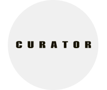

<p align="center">
  <a href="">
    
  </a>
</p>

# Welcome to the repo of Curator's Frontend

There's not much here as of now since the project is currently under development but take a gander anyways!

1. **Clone the repo (Or download the zip file)**

    Simple enough. Click the big green clone button or just download the code and extract its contents.
  <br>
  
2. **Install Dependencies**

    Since this site requires a lot of libraries to get running, its best to ensure everything is installed. 
    ```shell
        yarn install
    ```
    <br>
3. **Start the Development Server**

    Now that everything is set up, go ahead and spin up a dev server using:
    ```shell
        yarn run dev
    ```
    **Great!** Now the server should be running on `http://localhost:8000`, or if said port is unavailable, the terminal should specify another port which was used instead.